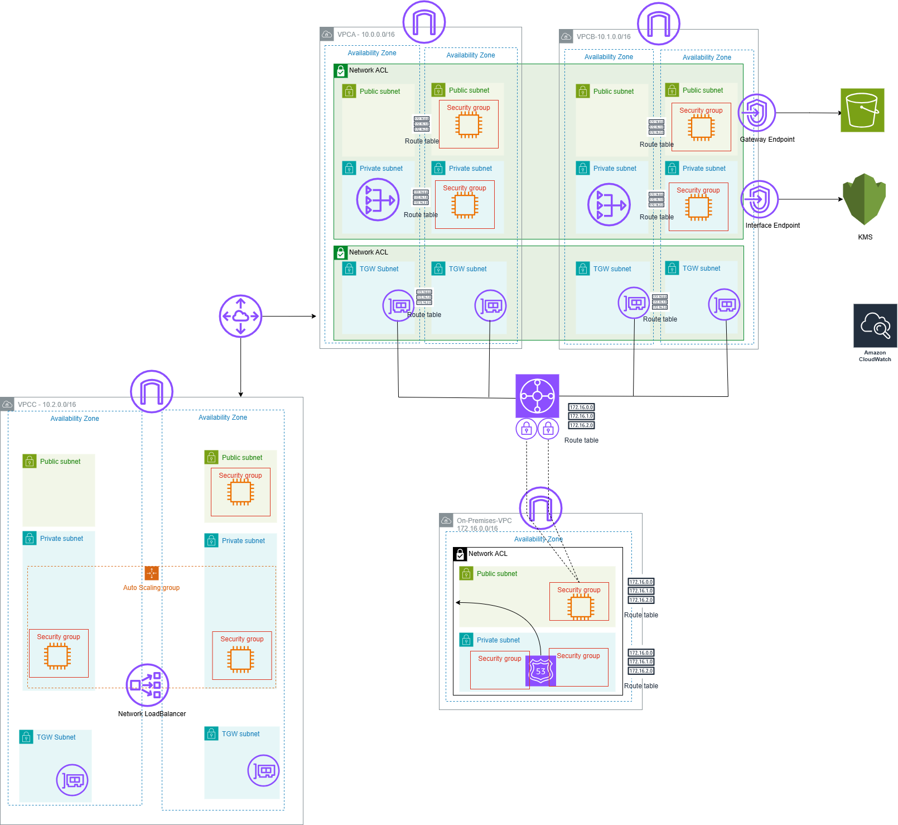

# Networking Immersion Day

## Table of Contents
1. [Introduction](#introduction)
2. [Workshop Preparation](#workshop-preparation)
3. [Proposed Topology](#proposed-topology)
4. [Pipeline](#pipeline)
5. [Cost Estimate](#cost-estimate)
6. [Conclusion](#conclusion)

---

## Introduction
This workshop focuses on building a networking infrastructure on AWS, integrated with a CI/CD pipeline using **Terraform**, **GitHub Actions**, and security/optimization checks via **Checkov**. The goal is to help you understand the main infrastructure components, how to connect multiple VPCs (VPC Peering, Transit Gateway, VPN, etc.), and how to automate the deployment process with security scanning.

---

## Workshop Preparation
1. **Fundamental Knowledge**:
   - Basic AWS knowledge (VPC, Subnet, EC2, NAT Gateway, Load Balancer, etc.).
   - Basic Terraform knowledge (writing `.tf` files, running `terraform init`, `terraform plan`, `terraform apply`, etc.).
   - Basic GitHub Actions knowledge (configuring workflows, triggers, etc.).
   - Understanding how Checkov scans and enforces security compliance in Infrastructure as Code (IaC).

2. **Tools**:
   - An AWS account or sandbox environment (if available).
   - A local machine with Terraform installed (latest version).
   - A GitHub account for running GitHub Actions.
   - Checkov (installed locally or run via a pipeline).

3. **Objectives**:
   - Build a multi-VPC architecture connected via a Transit Gateway.
   - Ensure security and observability (using CloudWatch).
   - Automate deployments using Terraform, version control via GitHub, and run security checks via Checkov in GitHub Actions.

---

## Proposed Topology
Below is a proposed diagram for the networking environment on AWS:

### Diagram 1

Key components in the diagram:
- **VPC-A**, **VPC-B**, **VPC-C**, and **On-Premises-VPC** (simulating an on-premises network).
- Connectivity between VPCs via **Transit Gateway**.
- Each VPC includes **public subnets**, **private subnets**, a NAT Gateway, an Internet Gateway (IGW), and endpoints (gateway/interface) as needed.
- **Load Balancer** (NLB or ALB) for traffic distribution.
- **Route 53** for DNS management if needed.

---

## Pipeline
The deployment pipeline is illustrated as follows:

### Diagram 2

Workflow:
1. **Terraform**: Contains the Infrastructure as Code (IaC).
2. **GitHub Actions**: Automatically runs the workflow when changes are pushed to the repository (push, pull request).
3. **Checkov**: Scans for security and compliance issues in the Terraform code before `terraform apply`.

**Process**:
- A developer pushes Terraform code to GitHub.
- GitHub Actions starts, installs Terraform, and runs `terraform plan`.
- Checkov scans the Terraform code, reporting any security violations.
- If the scan passes, GitHub Actions can optionally run `terraform apply` to deploy the infrastructure to AWS.

---

## Cost Estimate
The tables below show estimated monthly costs for each VPC, along with the overall total. Actual costs may vary based on region, data transfer, and usage.

### VPC-A

| **Service**        | **Quantity**                           | **Cost per month** |
|--------------------|----------------------------------------|--------------------|
| VPC                | 1                                      | -                  |
| Transit Gateway    | 1 attachment 1 GB/month             | 36.50 USD          |
| EC2               | 4 EC2 t2.micro Monitoring enabled    | 23.00 USD          |
| NAT Gateway        | 1 NAT 1 GB/month                    | 32.85 USD          |
| Client VPN         | 1 subnet 1 connection               | 74.10 USD          |
| Public IPv4        | 2 public IPv4 addresses                | 14.60 USD          |
| Data Transfer Out  | 1024 GB x 0.09 USD/GB = 92.16 USD       | 92.16 USD          |
| CloudWatch         | 4 metrics = 1.2 USD Logs = 1.26 USD | 2.46 USD           |
| **Total**          |                                        | **275.67 USD**     |
| **Cost per hour**  |                                        | **0.39 USD**       |

---

### VPC-B

| **Service**        | **Quantity**                           | **Cost per month** |
|--------------------|----------------------------------------|--------------------|
| VPC                | 1                                      | -                  |
| EC2               | 4 EC2 t2.micro Monitoring enabled    | 23.00 USD          |
| Transit Gateway    | 1 attachment 1 GB/month             | 36.50 USD          |
| NAT Gateway        | 1 NAT 1 GB/month                    | 32.85 USD          |
| Public IPv4        | 2 public IPv4 addresses                | 14.60 USD          |
| Data Transfer Out  | 1024 GB x 0.09 USD/GB = 92.16 USD       | 92.16 USD          |
| ENI (Interface Endpoint) | 1 (for endpoint)                 | -                  |
| Gateway Endpoint   | 1 (for S3)                             | -                  |
| Interface Endpoint | 1 (for KMS)                            | -                  |
| S3                 | 1 Bucket                               | -                  |
| KMS                | 1 Key                                  | -                  |
| CloudWatch         | 4 metrics + logs (estimated)           | 2.46 USD           |
| **Total**          |                                        | **201.57 USD**     |
| **Cost per hour**  |                                        | **0.28 USD**       |

---

### VPC-C

| **Service**         | **Quantity**                                        | **Cost per month** |
|---------------------|-----------------------------------------------------|--------------------|
| VPC                 | 1                                                   | -                  |
| EC2 (ASG)           | Desired: 2 Min: 1 Max: 2                      | 12.50 USD          |
| NAT Gateway         | 1 NAT 1 GB/month                                 | 32.85 USD          |
| Route 53            | -                                                   | -                  |
| Load Balancer (NLB) | 1 Network Load Balancer                             | 16.43 USD          |
| Data Transfer Out   | 1024 GB x 0.09 USD/GB = 92.16 USD                   | 92.16 USD          |
| CloudWatch          | 4 metrics + logs (estimated)                        | 2.46 USD           |
| **Total**           |                                                     | **156.40 USD**     |
| **Cost per hour**   |                                                     | **0.22 USD**       |

---

### On-Premises-VPC

| **Service**         | **Quantity**                           | **Cost per month** |
|---------------------|----------------------------------------|--------------------|
| VPC                 | 1                                      | -                  |
| EC2                | 2 EC2 t2.micro Monitoring enabled    | 12.50 USD          |
| Transit Gateway     | 1 attachment 1 GB/month             | 36.50 USD          |
| NAT Gateway         | 1 NAT 1 GB/month                    | 32.85 USD          |
| Route 53            | -                                      | -                  |
| Data Transfer Out   | 1024 GB x 0.09 USD/GB = 92.16 USD       | 92.16 USD          |
| CloudWatch          | 4 metrics + logs (estimated)           | 2.46 USD           |
| **Total**           |                                        | **176.47 USD**     |
| **Cost per hour**   |                                        | **0.25 USD**       |

---

### Overall Cost
- **Total cost per hour** for all 4 VPCs: **1.14 USD/hour**.
- **Cost for 2 days** (8 hours/day): 16 hours * 1.14 USD/hour = **18.24 USD** (estimated).

---
